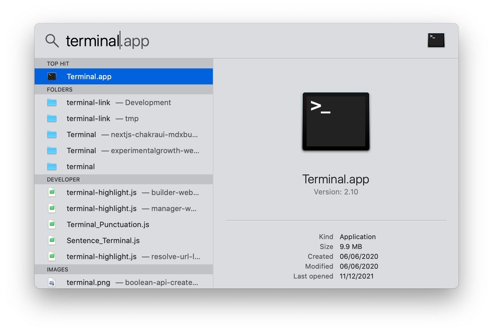
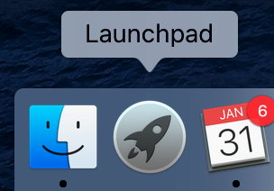

# macOS Setup Instructions

## Setting up Terminal.app

The Terminal is a program that developers use to run commands that tell the operating system (or another program), to perform specific tasks.

With the Terminal program we can install softwares that can be run from the terminal that perform really useful tasks for developers (such as creating an empty starter project, to running our project and so on).

On macOS we can launch the terminal in the following ways.

**Option 1:** from spotlight search.

- Press `CMD+Space` on your keyboard
- In the search bar, type "Terminal"
- Press enter or click on the Terminal application



**Option 2:** from Launchpad

- Open Launchpad
- In the search bar, type "Terminal"
- Click to open the terminal app



**Launch & add to Launchbar**

1. Launch the Terminal application using one of the options above
2. In the Launcher toolbar, right-click on the Terminal App -> Options -> Keep in Dock
3. You can now launch the Terminal by clicking in the launcher toolbar


## Install Homebrew

[Homebew homepage](https://brew.sh/)

Homebrew is a program that runs in the terminal that developers use to install other programs/software and libraries that we want to use for creating or running our own programs.

Homebrew simplifies installing dependencies.

1. Launch the Terminal app
2. Paste the following command in the terminal (`CMD+V` or right-click -> paste)

```bash
/bin/bash -c "$(curl -fsSL https://raw.githubusercontent.com/Homebrew/install/HEAD/install.sh)"
```

3. Press enter and wait for the command to complete the installation
4. Type the following command in the terminal and press enter. This will update homebrew

   `brew update`

5. You're good to go!

## Install git

`git` is a program that allows developers to create snapshots of their code (backups) so that it is very easy to go back to a previous version in case we make some big mistakes in our code, or collaborate with other developers, when we end up writing code in the same files.

1. Launch the Terminal app
2. Type this command and press enter

   `brew install git`

3. Check that git is installed by typing the following command

   `git -v`

   Thie above should produce something similar to:

   ```bash
   > git --version
   git version 2.24.3 (Apple Git-128)
   ```

## Install VSCode

[Visual Studio Code](https://code.visualstudio.com) is a code editor. It allows us to manage the files in a project and to edit the code that we write. It comes with a large number of very useful features that make development faster and easier. We can also improve its functionality by installing many extensions.

1. Open Terminal app
2. Make sure you have updated `brew` with

   `brew update`

3. Run the following command that will take care of installing VSCode for you

   `brew install --cask visual-studio-code`

4. Visit [VSCode's download page](https://code.visualstudio.com/download)
5. Download the macOS version
6. Once downloaded, open Finder and locate the file in the `Downloads` folder. You might need to double click on the `.zip` file in order to unzip the file and obtain the `Visual Studio Code.app`
7. Drag `Visual Studio Code.app` to your `Applications` folder.
8. Launch the application and pin the application to your launchbar, the same way as we did for the Terminal app.

Now follow the instructions for setting up the extensions for VS Code.

[Setup VSCode Extensions](vscode-setup-instructions.md)

## Install NodeJS

## Setup SSH Keys for Github

### Adding SSH Keys onto Github account
