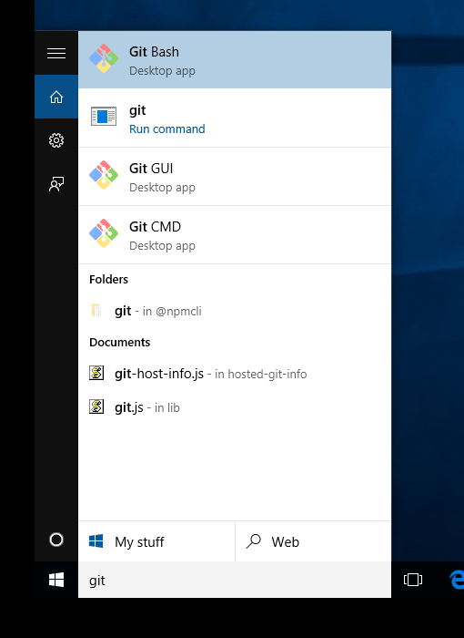
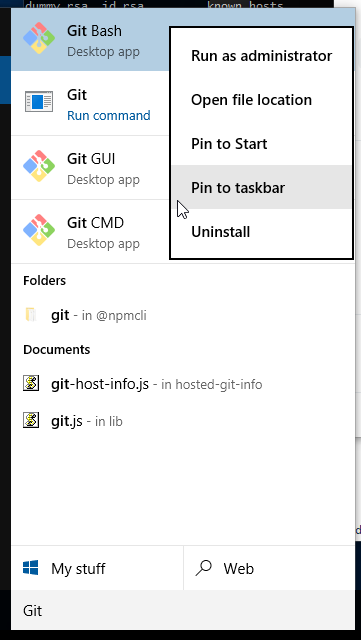
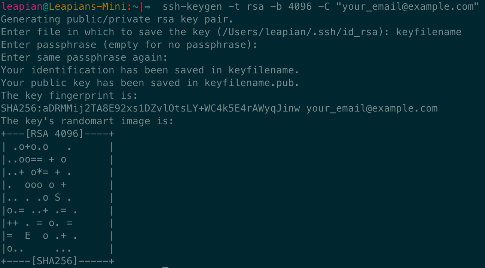

# Windows Setup Instructions

There are 4 steps in this guide:

1. Install git & Git Bash
2. Install Visual Studio Code

   2.1 Install VSCode Extensions
   2.2 Set Default Terminal in VSCode to Git Bash

3. Install NVM and NodeJS
4. Setup SSH Keys for GitHub

   4.1 Add SSH Keys to GitHub
   4.2 Check SSH & GitHub Setup
   4.3 Add Your Identity Details for Git Operations

## 1. Install git & Git Bash

`git` is a program that allows developers to create snapshots of their code (backups) so that it is very easy to go back to a previous version in case we make some big mistakes in our code, or collaborate with other developers, when we end up writing code in the same files.

1. Browse to the [Git Download for Windows page](https://git-scm.com/download/win) and select the `Standalone Installer (64-bit Git)` download - unless you have a `32-bit version of Windows`.
2. Once the download is complete, run it from your browser's download bar.

   1. **Select defaults for all options during the installation**.

   2. When the installation is complete, press the `<Windows>` key and type `git` into the search box to find the `git bash` app

      

   3. Right click on the `git bash` app and click `Pin to taskbar` so you can start it quickly from the Taskbar.

      

   4. Click the `git bash` icon in the Taskbar to run it

      1. Type the following text in the `git bash` window and then `<Enter>`

         ```text
         touch .bashrc
         ```

         If you get **an error stating** that you don't have permissions to create the file, then it is likely `git bash` did not launch from the correct folder. Make sure you followed steps 2 and 3 above, if not seek support.

      2. Type `exit` then `<Enter>` to close this window

   5. Now click the `git bash` icon in the Taskbar to run it again

      1. This time you should see some messages like `missing setup message related to .bash_profile`

         

      2. The warning message tells us `git bash` is now set up properly and we are ready for the next steps.

   6. Exit the `git bash` window by typing `exit` and then `<Enter>`.
   7. Open a new `git bash` window by clicking on it's icon in the Windows Taskbar. This time, you should not see the warning above.

      1. At the `$` prompt in the new window, type `git --version` and then `<Enter>` to check `git` is correctly installed. You should see something like the following text displayed:

         ```text
         git version 2.35.1.windows.1

         user@PC-NAME MINGW ~
         $
         ```

      2. Finally type `exit` and then `<Enter>` to close the window.

## 2. Install VSCode

[Visual Studio Code](https://code.visualstudio.com) is a code editor. It allows us to manage the files in a project and to edit the code that we write. It comes with a large number of very useful features that make development faster and easier. We can also improve its functionality by installing many extensions.

1. Visit [VSCode's download page](https://code.visualstudio.com/download) and select the `User Installer 64 bit` download - unless you have a `32 bit version of Windows`.
2. Once the download is complete, run it from your browser's download bar.
3. Launch VSCode and make sure to pin the software to the Taskbar for future access.

### 2.1 Install VSCode Extensions

Now follow the instructions for setting up the extensions for VS Code.

[Setup VSCode Extensions](vscode-setup-instructions.md)

### 2.2 Set Default Terminal in VSCode to Git Bash

1. Open VSCode
2. Press `Ctrl+Shift+P` or `F1` which will open the command palette
3. Type: `Terminal: Select Default Profile` (you don't need to type this fully) and press enter on this option or click on it.
4. Select `Git Bash` as the default terminal (by pressing enter on that option or click on it).

## 3. Install NVM and NodeJS

[NodeJS](https://nodejs.org/en/) is a runtime environment for JavaScript. It allows us to build and run javascript applications. We shall make extensive use of this throughout the course.

We will use a tool called `nvm` to install NodeJS - [Link to GitHub Repository](https://github.com/nvm-sh/nvm)

1. Open a new `git bash` window by clicking it's icon in the Windows Taskbar - set up in step 1 above.
2. Paste the following command into the `git bash` window

   ```text
   curl -o- https://raw.githubusercontent.com/nvm-sh/nvm/v0.39.1/install.sh | bash

   ```

3. Once the above completes, close the current `git bash` window and open a new one before you continue.
4. Install the latest version of NodeJS

   `nvm install --lts`

   **Note**: it might take a few seconds before any output starts to appear in the terminal.

5. Restart terminal and run the final command.

   `nvm use --lts`

6. Confirm that you are using the latest version of Node and npm. Version 16 is the latest stable. If you installed version 17 for Node, that is also OK. `npm` should be version 8+.

   `node -v && npm -v`

Further reading on nvm: [https://github.com/nvm-sh/nvm](https://github.com/nvm-sh/nvm)

## 4. Setup SSH Keys for Github

An SSH key is an access credential for the SSH (secure shell) network protocol. This authenticated and encrypted secure network protocol is used for remote communication between machines on an unsecured open network. SSH is used for remote file transfer, network management, and remote operating system access.

We will need SSH Keys in order to push our code to GitHub.

> GitHub have a [detailed guide for you to follow](https://docs.github.com/en/authentication/connecting-to-github-with-ssh/generating-a-new-ssh-key-and-adding-it-to-the-ssh-agent), although we have summarised some of the key steps here.

1. Click the `git bash` icon in the Taskbar to run it
2. Run the following command (will create a hidden folder called `.ssh`, if it doesn't exist already)

   `mkdir .ssh`

3. Run the following command to move into the newly created directory

   `cd .ssh`

   Make sure you are in the `.ssh` folder. Run the command `pwd` and you should expect to see this output:

   `/c/Users/<YOUR_USERNAME>/.ssh`

4. Now we run the following command to generate a new SSH key and save it to our machine. Make sure you replace *your_email@example.com* with your email - this is just a name for the key and it allows you to recognise it.

   `ssh-keygen -t rsa -b 4096 -C "your_email@example.com"`

   Once you press enter, you will be asked to choose a filename (you can go for `githubkeys`).

   **NOTE** When asked for a passphrase and then again to confirm, please simply press enter to skip this step.

   Once you have followed the instructions, you should see an output similar to this:

   

5. Now we need to update the configuration for SSH so that it knows to use the newly created key when you attempt to authenticate with github. Make sure you are in

   Make sure you are in the `.ssh` folder. Run the command `pwd` in your Terminal and you should expect to see this output:

   `/c/Users/<YOUR_USERNAME>/.ssh`

   Now we try to create an empty `config` file, if it doesn't exist already by running:

   `touch config`

   Now run the command `code ./config` which will open the empty (or existing) `config` file directly in Visual Studio Code.

   You now want to add the following configuration at the bottom of your `config` file and **save**:

   ```
   Host github.com
     HostName github.com
     PreferredAuthentications publickey
     IdentityFile ~/.ssh/githubkeys
   ```

   **NOTE:** you will have to replace `~/.ssh/githubkeys` with the key filename that you chose in step 4.

### 4.1. Adding SSH Keys onto Github account

Once you have generated SSH Keys on your machine, we need to add the public key to our github account so that github can authenticate your machine and allow you to push code to github.

1. Click on the `git bash` icon in the Taskbar to run it.
2. Open the public SSH key file that you created earlier by running

   `code ~/.ssh/YOUR_GITHUB_SSH_KEY.pub`

   Replace `YOUR_GITUBH_SSH_KEY` with the filename of the SSH key that you generated earlier.

   The file should look something like:

   ```
   ssh-rsa AAAAB3NzaC1yc2EAAAADAQABAAACAQDHFR60xwGFKN5DHVaMKy7t6mwV0qFDHtLUkxQlUoMCN5Pmn3VXkiUminNDDVtYdDT0BQ70UTPXi6Q6GbinaYNvlOjKDeHnZoMltLcyqSK9EFjZVaUj8zXgX8dARgU+tROjNA6gj3gsO59zO5vqhrJZxWLtYisU3vuuUx2eKwwwIekzMMfoU6lej5l7VIKZ6l6cpxNnPvNKdPB8/cZHJqgVkXoJf+yx7Na5oC/LjEL3Ud4kRnKuEY5PkDYfKYsVQXcja+lgIKPswK5FwFXE5GyAXhlJOBW0EVkatqwXOD6XT6kcUnNsgmezUNbvvhJgV5oez4Y59jPVUWhwgO+eKrT6mKNthVWDddACClVpnN1iMSTgo+W5nfIL2yUOEZ+IvS5RvyUxLe5R4n5sHQDx1FF1oq8UXTquVmQyp1nmagPze7S7qezYsiTSDXTjZxlurhDeva0rLJZ8jD4fL/By4Hldp4zj4YEdw4VORzaQTNXHFL/QDcQfXzPUoDfFB3TUvEG4vqrkfjypkIWpzxCfjFBJqRwLqc+ri9Xtvv4mOBd9M0D1pSbToj6ubvbw1nrTgSyNQ5m9PPQa2ppWrps0N7y2fAjLVScjXUj897OJZehb9V0yM03UosRUNRjdiEA8usOqR+NInISXYH97jw+hILuewaSOb443aKfuDHAu48O1Bw== your_email@example.com
   ```

3. Select _all_ the text with `<Ctrl-A>` and copy it to clipboard with `<Ctrl-C>`
4. Visit your [Github settings](https://github.com/settings/profile) page (requires login, then find your profile icon and the dropdown next to it will take you to the Settings page).
5. From your Github Settings page, you will find the SSH and GPG Keys section in the left sidebar (alternatively, visit [https://github.com/settings/keys](https://github.com/settings/keys))
6. Click the green `New SSH Key` button.
7. Choose a title and paste the key you copied earlier with `<Ctrl-C>` (see the screenshot below)

   

   **NOTE**: make sure that when you paste, you are not pasting whitespace (new lines, spaces).

8. Click `Add SSH Key`

### 4.2 Check that SSH & Github are setup correctly

In your terminal, run the following command:

`ssh -T git@github.com`

If everything is correctly setup, you should see the following message:

`Hi <YOUR_GITHUB_USERNAME>! You've successfully authenticated, but GitHub does not provide shell access.`

### 4.3 Add Your Identity Details For Git Operations

Before you can use Git, you need to paste the following commands into a `git bash` window - you can open one by clicking on the `git bash` icon in the Taskbar.

```text
git config --global user.email "your_email@address"
git config --global user.name "Your Name"
```

This ensures any changes you make are tagged with you name. You will see this when you look at changes in GitHub, VSCode or using `git` commands.
